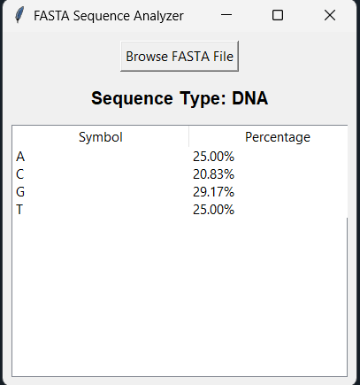

# FASTA Sequence Exercises

This repository contains 3 exercises related to DNA, RNA, and Protein sequence analysis:

1. **Alphabet Classifier**: Detects whether a given sequence is DNA, RNA, Protein, or Unknown.
2. **Percentage Calculator**: Calculates the relative frequency (percentage) of each symbol in a sequence.
3. **FASTA Reader with GUI**: Reads a FASTA file, detects the sequence type, and displays symbol percentages in a table.
---

## Example Images

### Protein Sequence

### DNA Sequence

